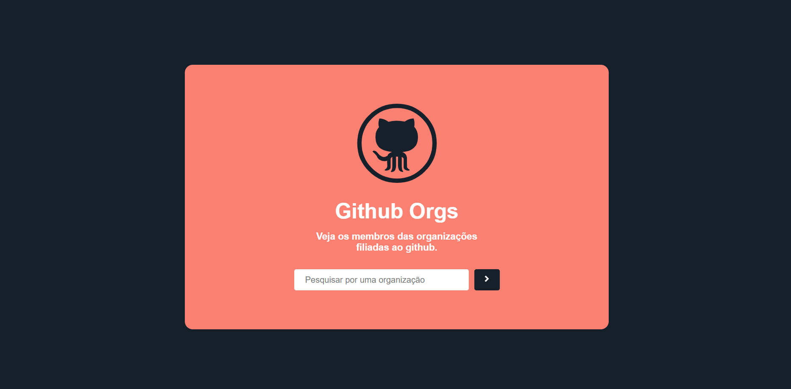
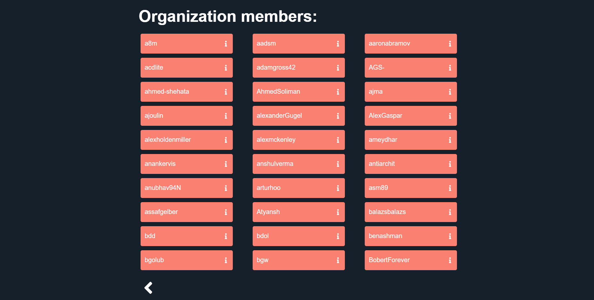
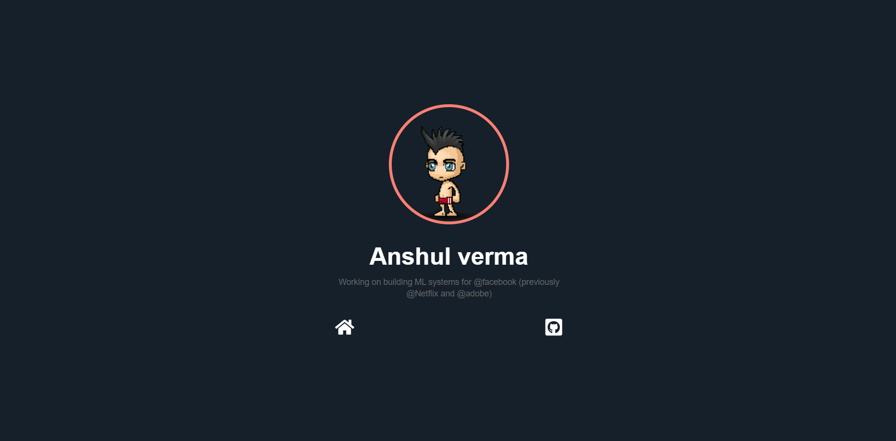

 
<h1 align="center">Github Orgs </h1>
 
 <h5 align="center">
 </h5>


<h4 align="center"></h4>

<h3 align="center">
  This application is developed in ReactJS and was implemented with SSR (Server-Side Rendering) with NextJS, with the purpose of consuming a github API, which is used to search for members of an organization affiliated with github.
</h3>

<p align="center">
  
  

  

  

  

</p>

<p align="center">
  <a href="#technologies">Technologies</a>&nbsp;&nbsp;&nbsp;|&nbsp;&nbsp;&nbsp;
  <a href="#objective">Project's goal</a>&nbsp;&nbsp;&nbsp;|&nbsp;&nbsp;&nbsp;
  <a href="#result">Result</a>&nbsp;&nbsp;&nbsp;|&nbsp;&nbsp;&nbsp;
  <a href="#structure">Structure</a>
</p>

<br />

<h2 id="technologies" name="technologies">
🚀 Technologies
</h2>

- [React](https://pt-br.reactjs.org/)
- [React dom](https://pt-br.reactjs.org/docs/react-dom.html)
- [React ga](https://github.com/react-ga/react-ga)
- [React icons](https://github.com/react-icons/react-icons)
- [Next](https://nextjs.org/)
- [Next routes](https://github.com/fridays/next-routes)
- [Axios](https://github.com/axios/axios)
- [Styled Components](https://styled-components.com/)


<br />

<h2 id="objective" name="objective">
🎯 Project's goal
</h2>

I created this application with the intuition to improve my understanding of ssr, as well as knowing the nextjs, it is very interesting how they work together, the base application is created following the teachings of rocketseat, but the whole layout and styling were a great challenge for me, I really liked the result.

<br />

<h2 id="result" name="result">
✅ Result
</h2>

#### Main screen
<h5 align="center">

#### Orgs Members screen

<h5 align="center">

#### Member screen

<h5 align="center">

<br />
<br />

<h2 id="structure" name="structure">
🧱 Structure
</h2>

#### SSR

The google it will index and access your page without javascript, any content that comes through http, will not be indexed in google.

SSR passes the responsibility of the first rendering to the server, as the request is controlled by the server and sent to the first rendering without using javascript, google recognizes and indexes your page.

##### Custom server

```js
const { createServer } = require("http");
const next = require("next");
const routes = require("./routes");

const dev = process.env.NODE_ENV !== "production";
const app = next({ dev });
const handle = routes.getRequestHandler(app);

app.prepare().then(() => {
  createServer(handle).listen(3000);
});
```

##### Next routes

```js
const routes = require("next-routes");

module.exports = routes()
  .add("/", "home")
  .add("/orgs/:org", "users")
  .add("/users/:user", "detail")
  .add("/error", "error");

```

##### Next link

```js
import Link from "next/link"; 
...

function checkInputValue(org) {
  if (org == null || org == "" || org == undefined) {
    return (org = "/error");
  }

  return `/orgs/${org}`;
}
...

<Link href={`${checkInputValue(org)}`}>
  <SubmitButton>
    <a>
      <FaAngleRight color="FFF" size={18} />
        </a>
      </SubmitButton>
</Link>
```

##### Next head

```js
import Head from "next/head"; ...

 <Head>
    <title>Home</title>
 </Head>
```

##### Next document

```js
import Document from "next/document"; ...

static async getInitialProps(ctx) {
    const sheet = new ServerStyleSheet();
    const originalRenderPage = ctx.renderPage;

    try {
      ctx.renderPage = () =>
        originalRenderPage({
          enhanceApp: (App) => (props) =>
            sheet.collectStyles(<App {...props} />),
        });

      const initialProps = await Document.getInitialProps(ctx);
      return {
        ...initialProps,
        styles: (
          <>
            {initialProps.styles}
            {sheet.getStyleElement()}
          </>
        ),
      };
    } finally {
      sheet.seal();
    }
  }

```

##### next app

```js
import App from "next/app"; ...

const { Component, pageProps } = this.props;
    return (
      <ThemeProvider theme={theme}>
        <Component {...pageProps} />
        <GlobalStyle />
      </ThemeProvider>
    );
```

##### Public folder

```js
export default function Mylogo() {
  return (
    
  );
}

```

<br />


<hr>

Made with 🧡 By Elivelton Ferreira. [Get in touch!](https://www.linkedin.com/in/eliveltonsf/) :calling:
